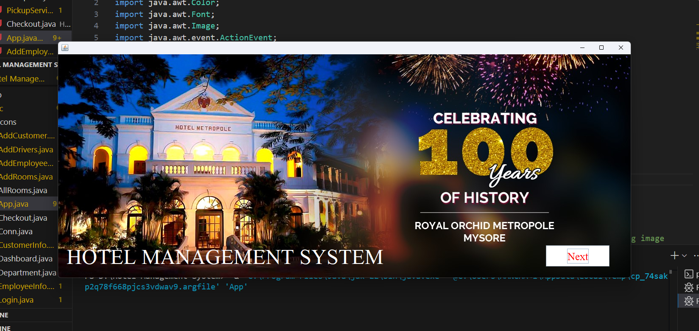
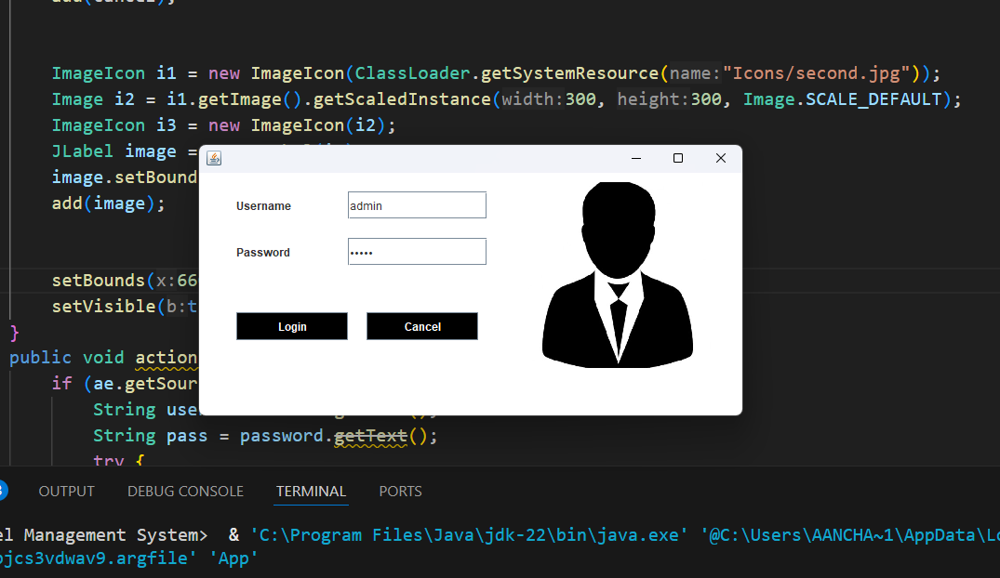
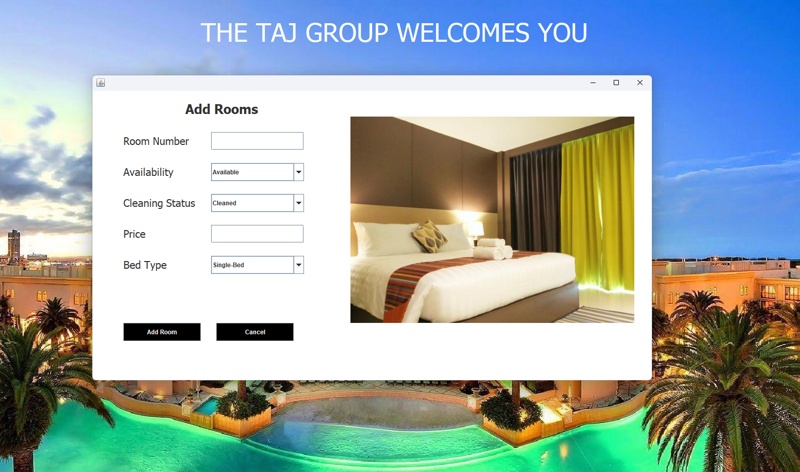
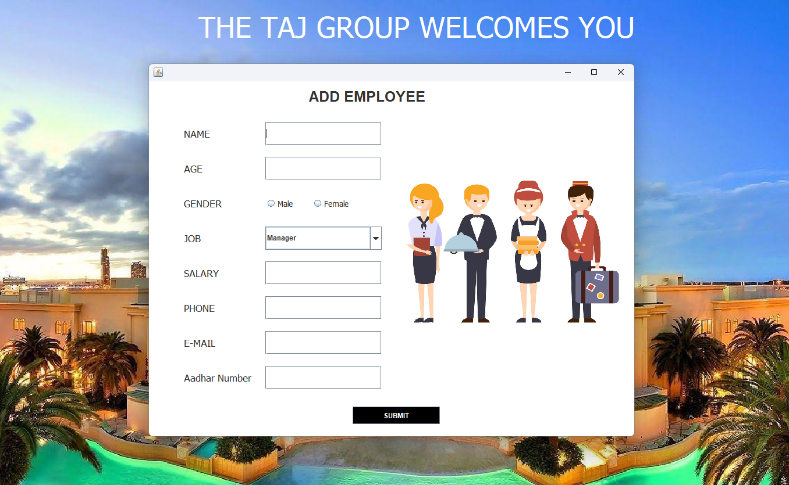
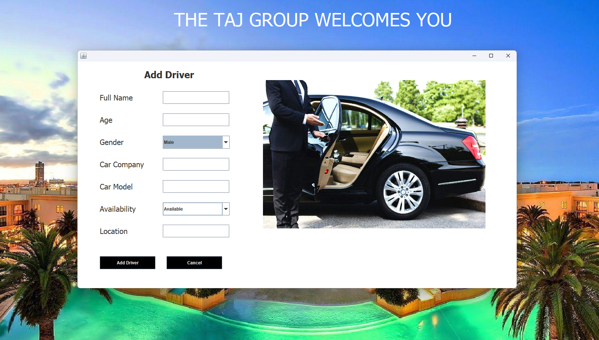
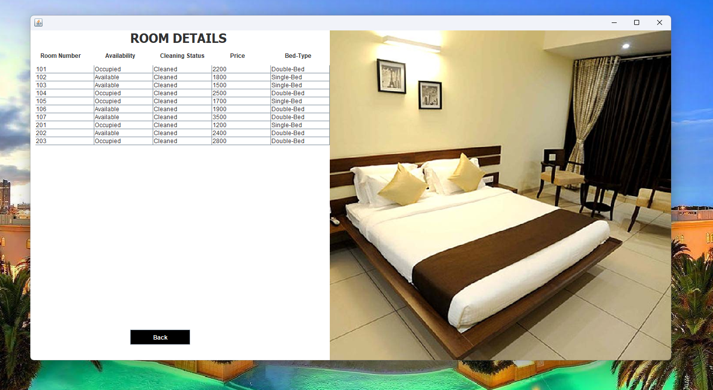
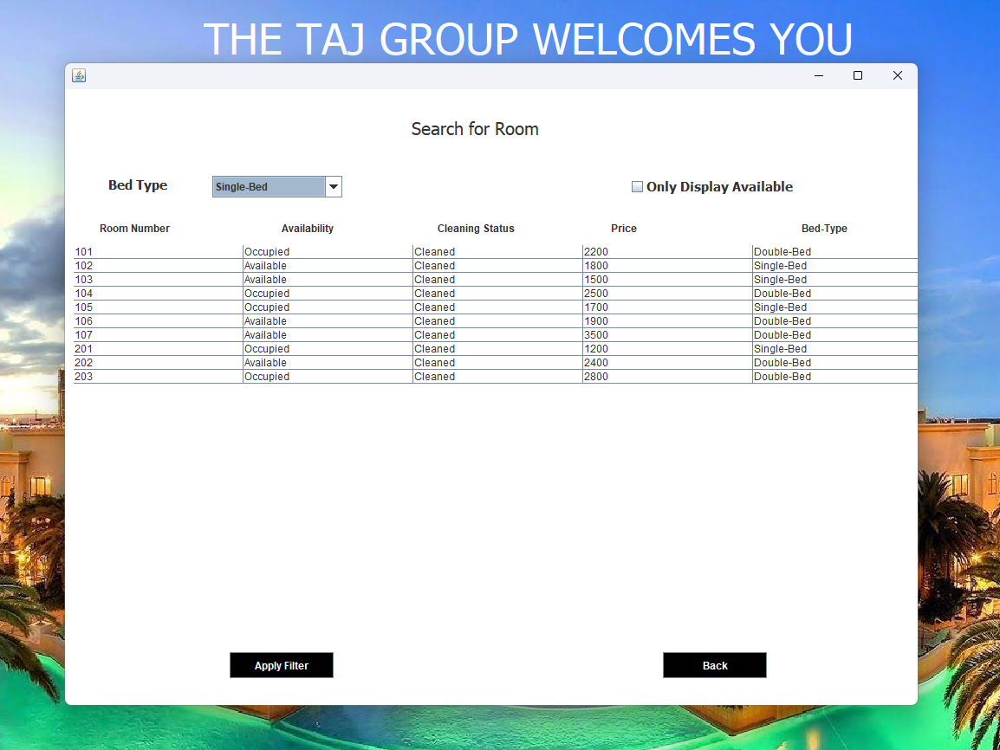
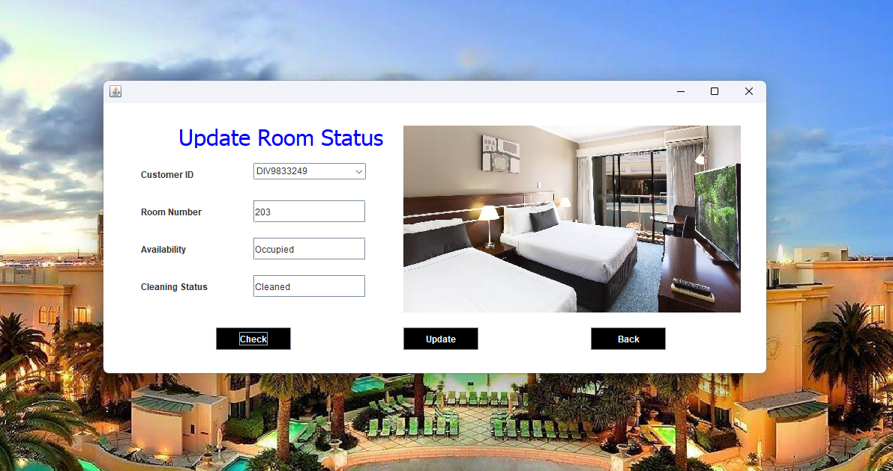
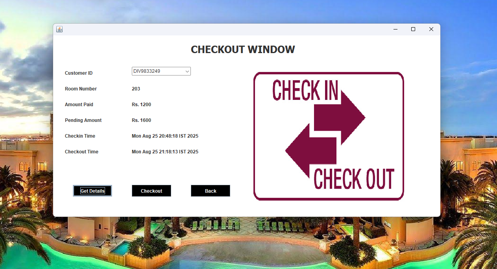

# 🏨 Hotel Management System  

A **Java Swing + AWT + JDBC + MySQL** based desktop application for managing hotel operations such as room booking, customer details, employee management, and reception services.  
Developed by **Pratik Prakash Tiwari**.

---

## 🚀 Features  

### 🔑 Authentication  
- Secure **Login Page** with username & password  

### 🛠 Admin Panel  
- Add Rooms  
- Add Employees  
- Add Drivers  

### 🏨 Reception Panel  
- Customer Check-in & Check-out  
- Update Room Status  
- View Department Info  
- View All Customer Details  
- Search Room Availability  
- Arrange Pickup Services  
- Get Manager/Employee Details  
- Logout  

---

## 📸 Screenshots  

### Home Page  
  

### Login Page  
  

### Dashboard (Reception Panel)  
  

### Add Rooms  
  

### Add Employee  
  

### Add Driver  
  

### Room Details  
  

### Search Room  
  

### Update Room Status  
  

### Checkout Customer  
  

---

## ⚙️ Tech Stack  
- **Java** (Swing & AWT for UI)  
- **JDBC** (Database Connectivity)  
- **MySQL** (Backend Database)  

---

## 🛠 Installation & Setup  

1. Clone this repository  
   ```bash
   git clone https://github.com/pratiktiwari001/hotel-management-system.git

2. Open the project in VS Code / any Java IDE.

3. Add MySQL JDBC Connector JAR in your lib/ folder.

4. Compile the project:
    javac -d bin -cp "lib/mysql-connector-java-8.0.28.jar" src/*.java

5. Run the project:
    java -cp "bin;lib/mysql-connector-java-8.0.28.jar" App

---

## 🗄️ Database Setup

1. Create a new database in MySQL:
    create database hotelmanagementsystem;
    use hotelmanagementsystem;


2. Create the required tables:
   ```
    create table login(username varchar(25), password varchar(25));

    create table employee(name varchar(25), age varchar(10), gender varchar(15), job varchar(30), salary varchar(15), phone varchar(10), email varchar(40), adhar varchar(12));

    create table room(roomNumber varchar(10), availability varchar(20), cleaningStatus varchar(20), price varchar(10), bedType varchar(20));

    create table driver(Name varchar(20), Age varchar(3), Gender varchar(10), Car_company varchar(20), Car_model varchar(20), Availability varchar(20), Location varchar(20));

    create table customer(ID varchar(20), ID_Number varchar(20), Name varchar(30), Gender varchar(20), Country varchar(20), Room_Number varchar(10), CheckIn_Time varchar(60), Deposit_Amount varchar(20));

    create table department(Department_name varchar(30), Budget varchar(20), No_of_Members varchar(10));
    insert into department values('Reception','200000','4');
    insert into department values('Cleaning Staffs','400000','20');
   

3. Insert a default admin user for login:
   ```
   insert into login values('admin','12345');


5. Update database connection in Conn.java:
   ```
   c = DriverManager.getConnection("jdbc:mysql://localhost:3306/hotelmanagementsystem","root","MySQL Password");

---

##  License  
**Educational Purposes Only:** You are free to clone, modify, and learn from the code, but **not allowed to use it for commercial purposes** without permission.

---

##  Author  
**Pratik Prakash Tiwari**  
🔗 [LinkedIn](https://www.linkedin.com/in/tiwaripratik222) | [GitHub](https://github.com/pratiktiwari001) 

